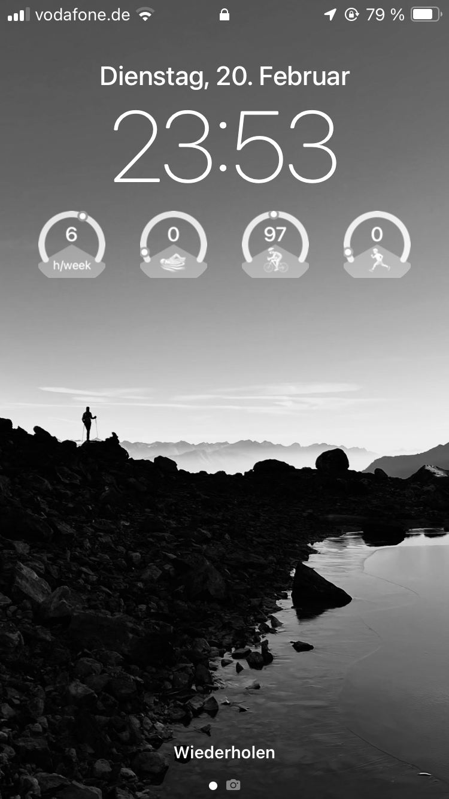

# Strava-IOS-Lockcreen-Widgets

Code for Scriptable to get Key Statistics from Strava onto IOS Lockscreen

## 🖥️ Preview
The Gauges offer a vivid snapshot of your distances covered in the past week across three key activities: Running, Cycling, and Swimming. Moreover, they aggregate and present your total training duration over the last seven days, giving you a concise and motivational overview of your fitness journey.

## 📲 Installation
After you have successfully registered for the Strava API and obtained your `client_id` and `client_secret`, you can install the widgets by following these steps:
1. Download the Scriptable app from the App Store.
2. Open the app and create a new script.
3. Copy the code from `stravaTotalDuration.js` and paste it into the script.
4. Insert your `client_id`, `client_secret`, and `refresh_token` into the script. (First lines of the script include a description of where to insert these values.)
5. Adjust the maximum values for the gauges to your personal preferences.
6. Run the Script to see if it works.
6. Give the script a name and save it.
7. Repeat Step 2-6 for `stravaRideDistance.js`, `stravaSwimDistance.js`, and `stravaRunDistance.js`.
8. Go to your Lockscreen and add a new Widget.
9. Select the Scriptable app and choose the widget size small (the round shape one).
10. Tap on the widget to select the script you want to display.
11. Repeat Step 8-10 for the other three scripts.
12. Enjoy your new Strava widgets on your Lockscreen!

## 📝 Notes
Feel free to adjust the widget to your needs. You can for example change the activities displayed. Make sure you have the correct `activity_type` in the URL of the Strava API request. You can find the `activity_type` in the Strava API documentation.

## 📜 License
This project is licensed under the MIT License - see the [LICENSE](LICENSE) file for details.

## 📧 Contact
If you have any questions or suggestions, feel free to open an issue or contact me via email.

## 📚 Resources
- [Strava API Documentation](https://developers.strava.com/docs/getting-started/)
- [Scriptable Documentation](https://docs.scriptable.app/)
- [Strava API Playground](https://developers.strava.com/playground/)
- [Strava API Authentication](https://developers.strava.com/docs/authentication/)

## 📋 To-Do
- [ ] Save energy by only updating the data once a day (maybe midnight)

Thanks to
https://github.com/dwd0tcom/strava-scriptable-widget

